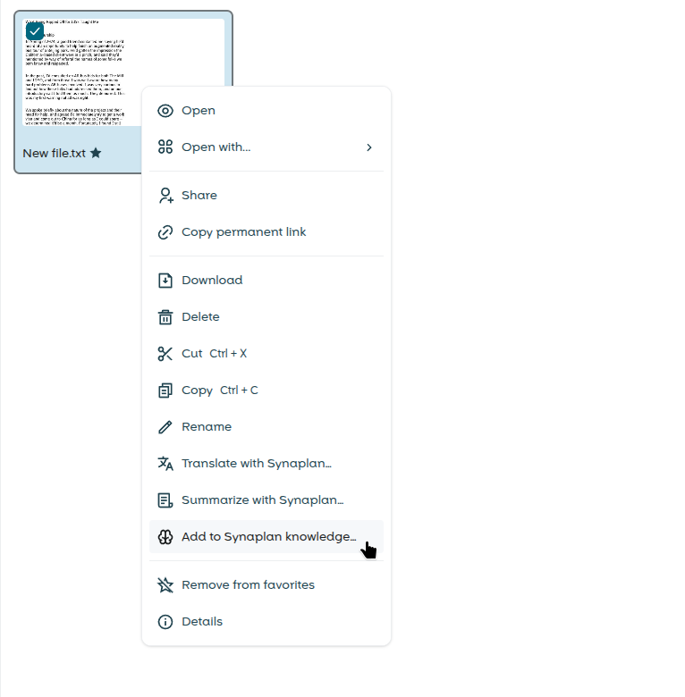

# Synaplan OpenCloud Integration

> **Early development — not ready for production use.**

OpenCloud web extension that integrates [Synaplan](https://github.com/metadist/synaplan) AI features into OpenCloud. Uses [RFC 8693 token exchange](https://datatracker.ietf.org/doc/html/rfc8693) for per-user authentication.



**Synaplan and OpenCloud must be behind the same OIDC identity provider (Keycloak).** Token exchange only works when both services trust the same Keycloak realm. There is currently no support for separate identity providers.

> **Dev stack requires the [Synaplan dev stack](https://github.com/metadist/synaplan) running with `docker compose --profile oidc up -d`.**
>
> On Linux, add `127.0.0.1 host.docker.internal` to `/etc/hosts` (macOS/Windows: works out of the box).

## Quick Start

```bash
# 1. Start the Synaplan dev stack (in the synaplan repo)
cd ../synaplan && docker compose --profile oidc up -d

# 2. Build and start
make frontend-install && make frontend-build && make docker-up

# 3. Visit https://host.docker.internal:9200
#    Login with: testuser / testpass123
```

## Configuration

The frontend extension and the Go backend are configured separately.

**Frontend** — set the Synaplan instance URL via OpenCloud's [`apps.yaml`](dev/docker/opencloud.apps.yaml):

```yaml
synaplan:
  config:
    synaplanUrl: 'https://synaplan.example.com'
```

The app menu tile opens this URL in a new tab when set.

**Backend** — env vars (full list with descriptions in [`backend/pkg/config/config.go`](backend/pkg/config/config.go)).

The backend authenticates outbound calls to Synaplan in one of two modes. Pick one.

### Mode A: per-user OIDC token exchange (recommended)

Each call to Synaplan rides on the logged-in OpenCloud user's identity, exchanged via Keycloak's RFC 8693 token-exchange grant. Synaplan sees the real user; per-user audit, quotas and rate limits work as expected. Requires Synaplan and OpenCloud to share the same Keycloak realm.

| Var | Purpose |
|-----|---------|
| `SYNAPLAN_URL` | Base URL of the Synaplan instance the backend talks to. |
| `SYNAPLAN_OIDC_TOKEN_ENDPOINT` | Keycloak token endpoint, used for token exchange. |
| `SYNAPLAN_OIDC_EXCHANGE_CLIENT_ID` / `SYNAPLAN_OIDC_EXCHANGE_CLIENT_SECRET` | Confidential client credentials that perform the exchange. |
| `SYNAPLAN_OIDC_TARGET_AUDIENCE` | Audience (Synaplan client ID) baked into the exchanged token. |

### Mode B: shared API key (simple, discouraged)

For single-tenant deployments where Synaplan and OpenCloud don't share an identity provider, the backend can attach a single static Synaplan API key to every outbound call instead of doing token exchange. Generate one in Synaplan's API-Keys settings, then set:

| Var | Purpose |
|-----|---------|
| `SYNAPLAN_URL` | Base URL of the Synaplan instance. |
| `SYNAPLAN_API_KEY` | Synaplan API key (`sk_…`). Sent as `X-API-Key` on every outbound call. |

**Caveat:** in this mode every call to Synaplan looks like the same user. There is no per-user identity, no per-OC-user audit trail, no per-user quotas, and you cannot revoke access for an individual OpenCloud user without revoking the key for everyone. Prefer Mode A unless you understand and accept these tradeoffs.

When `SYNAPLAN_API_KEY` is set it takes precedence and the `SYNAPLAN_OIDC_*` variables are ignored.

### Shared

| Var | Purpose |
|-----|---------|
| `OC_REVA_GATEWAY` | CS3 gateway used by the backend to read user files. |
| `OC_JWT_SECRET` | Shared JWT secret with OpenCloud's reva proxy. |

The dev defaults live in [`docker-compose.yml`](docker-compose.yml) and use Mode A.

## Development

```bash
# Frontend
make frontend-install       # Install dependencies
make frontend-serve         # Vite dev server on :9201 (with HMR, auto-registers in OpenCloud)
make frontend-build         # Production build (CI only)
make frontend-lint          # ESLint
make frontend-format        # Prettier (write)
make frontend-format-check  # Prettier (check)
make frontend-typecheck     # TypeScript type check
make frontend-test-unit     # Vitest unit tests
make frontend-test-e2e      # Playwright E2E tests (against :9200)
make frontend-test-e2e-dev  # Playwright E2E tests (against vite dev server :9201)

# Backend
make backend-build         # Build Go binary
make backend-dev           # Air hot-reload
make backend-test          # Go tests
make backend-lint          # golangci-lint
make backend-format        # gofmt

# All
make format                # Format frontend + backend

# Docker
make docker-up             # Start OpenCloud + backend
make docker-down           # Stop

# Docs (service reference site — env vars, example config, deprecations)
make docs                  # Build Docusaurus site into docs/generated/ (gitignored)
make docs-serve-prod       # Serve the built site at http://localhost:3000
make docs-clean            # Wipe .cache/ + docs/generated/
```

## License

Apache-2.0
